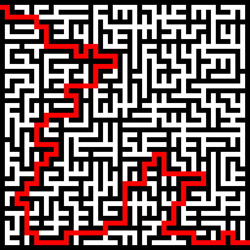

# Mazes
Maze Generator and Solver in Java



## Generating Mazes

To generate a maze, run

```
make maze
```

Specify the width and height of the maze and the maze will be generated as an `out.bmp` file.

## Solving Mazes

To generate and solve a maze, run

```
make solver
```

Specify the width and height of the maze. The unsolved maze will be saved as `maze.bmp` 
and the solved maze will be saved as `maze_solved.bmp`.
